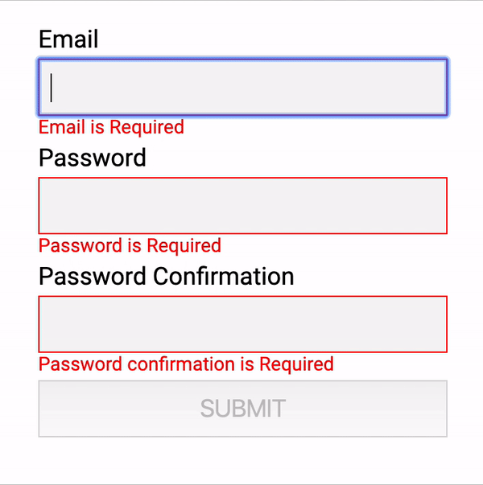
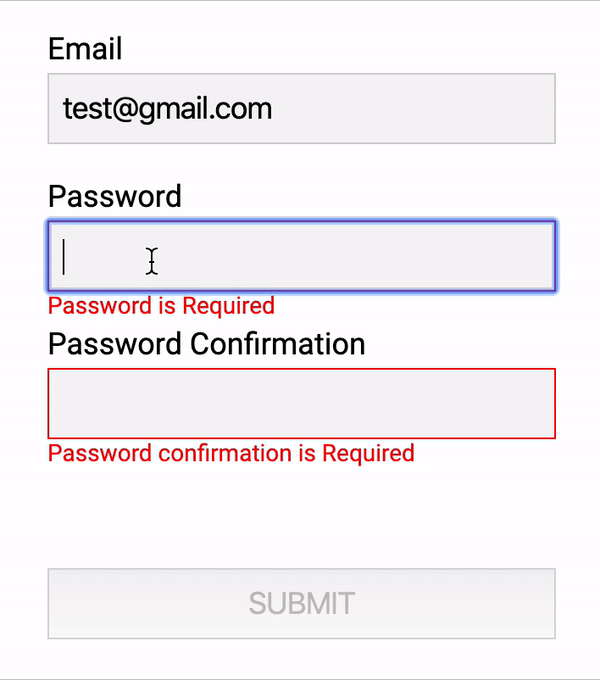
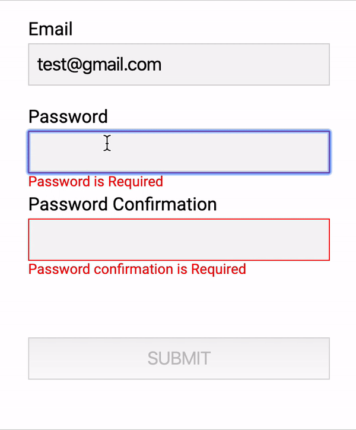
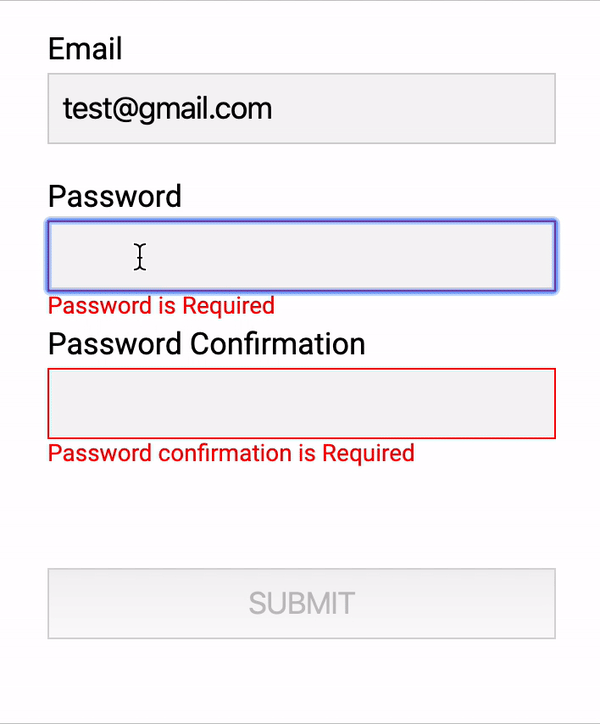

## Angular forms validation. Part II. FormGroup validation.

Recently I've started writing down some experience report on Angular development, validation topic in particular. The first part can be found [here](../angular-validation-part-i). I'm going to continue writing on it and today let's talk a little bit on FormGroup validation and validation of the dependent controls.

### The Password Confirmation Form example

As always we start from the code. Below you can see a declaration of the password confirmation form model. Some Angular provided Validators are applied to the fields.

```typescript
this.form = new FormGroup({
  email: new FormControl(null, [Validators.required, Validators.email]),
  password: new FormControl(null, [Validators.required]),
  confirmation: new FormControl(null, [Validators.required])
});
```

Html markup with Angular bindings

```html
<div class="form" [formGroup]="form">
  <label for="email">Email</label>
  <input name="email" type="text" formControlName="email" />
  <div class="errors">
    <span *ngIf="form.get('email').hasError('required')"
      >Email is Required</span
    >
    <span *ngIf="form.get('email').hasError('email')">Email is mailformed</span>
  </div>
  <label for="password">Password</label>
  <input name="password" type="password" formControlName="password" />
  <div class="errors">
    <span *ngIf="form.get('password').hasError('required')"
      >Password is Required</span
    >
  </div>
  <label for="confirmation">Password Confirmation</label>
  <input name="confirmation" type="password" formControlName="confirmation" />
  <div class="errors">
    <span *ngIf="form.get('confirmation').hasError('required')"
      >Password confirmation is Required</span
    >
  </div>
  <button [disabled]="!form.valid" type="submit">SUBMIT</button>
</div>
```

This code should show work similar to the giff provided below


Everything works pretty well. Thank you, Angular! But we still missing some important features. For instance, we are not checking for password and confirmation match. Let's fix it.

### FormGroup validator

We can not only apply Validators to FormControl but to all descendants of the AbstractFormControl, like FormGroup or FormArray. Custom validator for the FormGroup is what we need to implement password and confirmation match check. Below you can see the validator implementation.

```typescript
function passwordConfirmationMissmatch(
  control: FormGroup
): ValidationErrors | null {
  const password = control.get('password');
  const confirmation = control.get('confirmation');
  if (!password || !confirmation || password.value === confirmation.value) {
    return null;
  }

  return { 'password-confirmation-mismatch': true };
}
```

_NOTE: Implementation of the validator 'knows' about the form group structure, so it should be used in place and can not be generalized, unfortunately._

Now we have the validator, let's use it for our form.

```typescript
this.form = new FormGroup({
    ...
}, [passwordConfirmationMissmatch]);
```

And validation results should be handled at the markup

```html
<div class="form" [formGroup]="form">
  ...
  <div class="form-errors-summary">
    <div *ngIf="form.hasError('password-confirmation-mismatch')">
      Password confirmation does not match the password
    </div>
  </div>
  <button [disabled]="!form.valid" type="submit">SUBMIT</button>
</div>
```

Here we can see the result of our improvements.

It's already better and good enough for most cases. But some time we need to check our form validation by comparing with server-side data for example. Here the async validators come.

### FormGroup Async Validator

For our password setting form would be good to check if this password was alredy used with provided email. Let's implement async validator for such scenario and apply it to the FormGroup.

```typescript
function passwordMustBeDifferentFromThePrevious(
  control: FormGroup
): Observable<ValidationErrors | null> {
  const email = control.get('email');
  const password = control.get('password');
  const confirmation = control.get('confirmation');
  if (!email || !password || !confirmation) {
    return null;
  }

  return password.value === 'password'
    ? // 'delay' is used to simulate server call
      of({ 'password-previously-used': true }).pipe(delay(2000))
    : of(null).pipe(delay(2000));
}
```

Apply it to the FormGroup.

```typescript
this.form = new FormGroup({
    ...
}, [passwordConfirmationMissmatch], [passwordMustBeDifferentFromThePrevious]);
```

And use validation result at the markup. Also it would be good to somehow show at the UI that our async validation is in progress (FormGoup is in 'PENDING' status)

```html
<div class="form" [formGroup]="form">
  <div *ngIf="(form.statusChanges | async) === 'PENDING'" class="progress">
    VALIDATION IN PROGRESS
  </div>
  ...
  <div class="form-errors-summary">
    <div *ngIf="form.hasError('password-confirmation-mismatch')">
      Password confirmation does not match the password
    </div>
    <div *ngIf="form.hasError('password-previously-used')">
      Password was used already. Please select a different password.
    </div>
  </div>
  <button [disabled]="!form.valid" type="submit">SUBMIT</button>
</div>
```

Let's see what we've got at the UI after making this changes.

That is almost evrything can be done on such simple form validation. But some time we need to highlight fields in which changes should be made to fix FormGroup validation errors

### Highlight FormGroup validation errors on the controls.

When we are using FormGroup validation the error state applied to the FormGroup itself, not the FormControls inside it. All of them are at the valid state (pretty logical, we are good here). But what if we would like to highlight the errors for the controls at which changes must be made to fix the error? In our case, it gonna be password and password confirmation fields. Let's improve our validator and markup to do so.

```typescript
function passwordMustBeDifferentFromThePrevious(
  control: FormGroup
): Observable<ValidationErrors | null> {
  const email = control.get('email');
  const password = control.get('password');
  const confirmation = control.get('confirmation');
  if (!email || !password || !confirmation) {
    return null;
  }

  const result$ =
    password.value === 'password'
      ? // 'delay' is used to simulate server call
        of({ 'password-previously-used': true }).pipe(delay(2000))
      : of(null).pipe(delay(2000));

  return result$.pipe(
    tap((result) => {
      if (result) {
        password.setErrors({ ...password.errors, ...result });
        confirmation.setErrors({ ...password.errors, ...result });
      } else if (password.errors) {
        const passwordErrors = { ...password.errors };
        delete passwordErrors['password-previously-used'];
        const confirmationErrors = { ...confirmation.errors };
        delete confirmationErrors['password-previously-used'];
      }
    })
  );
}
```

_NOTE: Code inside validator is setting error state to the specific contols ('password' and 'confirmation') with respect to other errors which possibli can be already set here._

No changes required at the form declaration, but we need to handle 'password-previously-used' error for 'password' and 'confirmation' controls at the markup.

```html
<div class="form" [formGroup]="form">
  <label for="email">Email</label>
  <input name="email" type="text" formControlName="email" />
  <div class="errors">
    <span *ngIf="form.get('email').hasError('required')"
      >Email is Required</span
    >
    <span *ngIf="form.get('email').hasError('email')">Email is mailformed</span>
  </div>
  <label for="password">Password</label>
  <input name="password" type="password" formControlName="password" />
  <div class="errors">
    <span *ngIf="form.get('password').hasError('required')"
      >Password is Required</span
    >
    <span *ngIf="form.get('password').hasError('password-previously-used')"
      >Password was previously used</span
    >
  </div>
  <label for="confirmation">Password Confirmation</label>
  <input name="confirmation" type="password" formControlName="confirmation" />
  <div class="errors">
    <span *ngIf="form.get('confirmation').hasError('required')"
      >Password confirmation is Required</span
    >
    <span *ngIf="form.get('confirmation').hasError('password-previously-used')"
      >Password was previously used</span
    >
  </div>
  <div class="form-errors-summary">
    <div *ngIf="form.hasError('password-confirmation-mismatch')">
      Password confirmation does not match the password
    </div>
    <div *ngIf="form.hasError('password-previously-used')">
      Password was used already. Please select a different password.
    </div>
  </div>
  <button [disabled]="!form.valid" type="submit">SUBMIT</button>
  <div *ngIf="(form.statusChanges | async) === 'PENDING'" class="progress">
    VALIDATION IS IN PROGRESS
  </div>
</div>
```

Let's see how our complete validation works at the UI.


### Conclusion

Thank you! I hope you enjoyed the reading and found this information useful. All code samples are available at the [Github](https://github.com/musatov/angular-samples/tree/master/form-validators).

There are two other articles available on the topic:
[Angular forms validation. Part I. Single control validation.](../angular-validation-part-i)
[Angular forms validation. Part III. Async Validators gotchas.](../angular-validation-part-iii)
