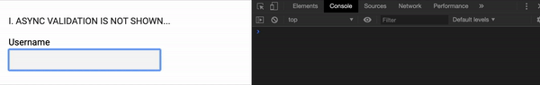
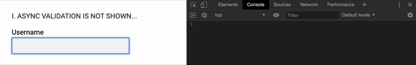
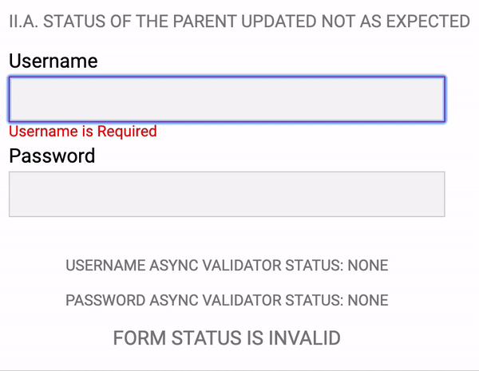
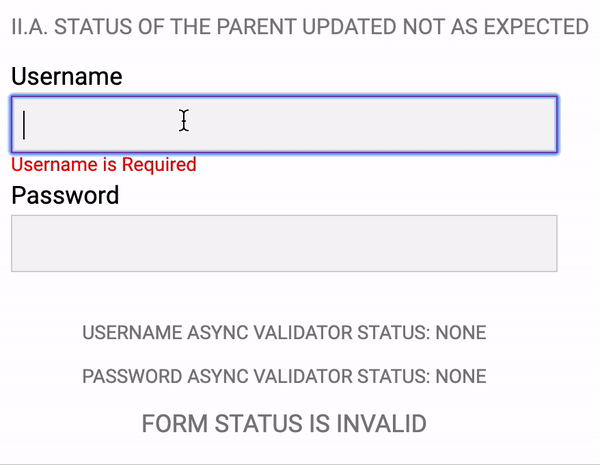
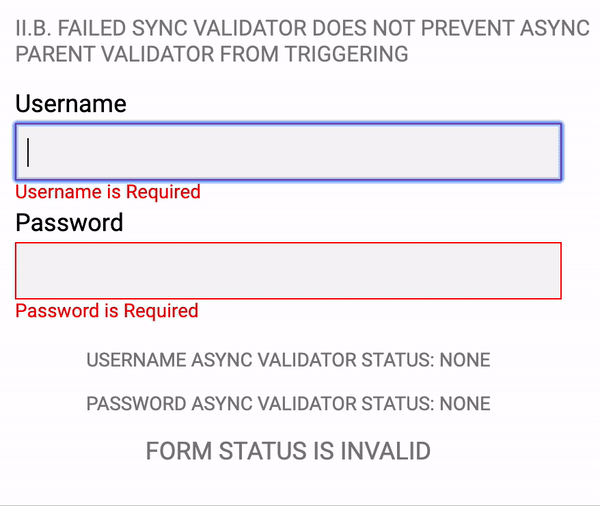

## Angular forms validation. Part III. Async Validators gotchas.

I'm about to continue to share my expertise on Angular's Forms Validation. Here we are going to take a look at some common "gotchas" of using async validators.

### I. The Async Validation is completed but there is no error message at the UI...

Yep, it is a really common problem. There is even an open [issue](https://github.com/angular/angular/issues/12378) at the Angular's GitHub repository. For the three and a half year open... And it's actually true not only for OnPush strategy but for the Default one too... Let's examine the scenario when you'll definitely face this problem.
Declare a simple component with the Default change detection strategy:

```typescript
@Component({...})
export class SingleControlComponent {
  readonly usernameControl = new FormControl(null,
    { asyncValidators: userDoesNotExist, updateOn: 'blur' });
}

function userDoesNotExist(control: FormControl): Observable<ValidationErrors | null> {
  console.log('Starting async validation...')
  const result$ = control.value !== 'test'
    // 'delay' is used to simulate server call
    ? of({'user-does-not-exist': true}).pipe(delay(1000))
    : of(null).pipe(delay(1000));

  return result$.pipe(tap(result => console.log(result)));
}
```

It contains a single `FormControl` with Async Validator function emulating username usage check. Component template markup gonna be the following:

```html
<label for="username">Username</label>
<input name="username" type="text" [formControl]="usernameControl" />
<div class="errors">
  <span *ngIf="usernameControl.hasError('user-does-not-exist')"
    >Username in not used</span
  >
</div>
```

After running this code we gonna see the following:

What is going on here? Let's split it into stages

1. User typing a valid value 'test' and then put the focus away from the filed (_NOTE: updateOn: 'blur' is used to prevent multiple validations calls_) after that he or she sees the message at the console notifying about started validation and then about completion without errors. So good so far.
2. The user updates the value to invalid one `test1`. And again we can see messages about started and completed validation at the console. Because validation does fail we have `{user-does-not-exist: true}` at the console. But we see **no errors** at the UI!
3. The user puts the focus in and then out of the filed. It triggers change detection and UI gets updated _NOTE: In case of OnPush strategy, change detection will not be trigger on this interaction and UI still be at the obsolete state. In the case of the OnPush strategy, we need to trigger change detection manually_.

So as you can see the only thing which is missed - we need to inform the Angular that it should run change detection, as soon as we have validation result. Adding the code below to our component will do exactly what is needed.

```typescript
...
constructor(cd: ChangeDetectorRef) {
  this.usernameControl.statusChanges.subscribe(() => cd.markForCheck());
}
...
```

Now everything works as expected


### II. Async Validators start simultaneously on parent and child

Some times we need to asynchronously validate not only the value at the single `FormControl` but for the whole `FormGroup`. Angular gives us such functionality, but unfortunately, not everything goes as expected. Two problems you are likely going to have are demonstrated below.

#### II.A Status of the parent updated not as expected

Usually, during an async validation, we would like to show some progress indication or lock form controls at the UI to inform the user. Angular's `AbstractFormControl` (and his descendants `FormControl` and `FormGroup`) has a useful observable property for such cases: `statusChanges`. The value of this property becomes `PENDING` if some async validation is going on. Below a little demo for this scenario.

Simple component with the `FormGroup` and async validator for the group.

```typescript
...
Component({...})
export class ParentChildStatusComponent {
  constructor() {
    this.form = new FormGroup({
      'username': new FormControl(null, [Validators.required]),
      'password': new FormControl(null, [])
    }, { updateOn: 'blur', asyncValidators: this.passwordAlreadyUsed.bind(this) });
  }

  private passwordAlreadyUsed(control: FormGroup): Observable<ValidationErrors | null> { ... }
}

```

_NOTE: Part of the code responsible for showing validation progress is omitted for simplicity_

Markup for this component:

```html
<div class="form" [formGroup]="form">
  <label for="username">Username</label>
  <input name="username" type="text" formControlName="username" />
  <div class="errors">
    <span *ngIf="form.get('username').hasError('required')"
      >Username is Required</span
    >
  </div>
  <label for="password">Password</label>
  <input name="password" type="text" formControlName="password" />
  <div class="progress validator">
    USERNAME ASYNC VALIDATOR STATUS: {{usernameValidatorStatus$ | async}}
  </div>
  <div class="progress validator">
    PASSWORD ASYNC VALIDATOR STATUS: {{passwordValidatorStatus$ | async}}
  </div>
  <div class="progress">
    FORM STATUS IS {{(form.statusChanges | async) || form.status}}
  </div>
</div>
```

Let's take a look at what we have got during the execution of this little demo


1. The form has single sync validator (`Validators.required`) on the 'username' FormControl. In the beginning, the form is in 'INVALID' state and no async validators are running or executed.
2. The user types a value into the username field then puts focus away from it (the form has updateOn: 'blur' option set), after that the sync validator had been executed and the result is valid. Then async validator of the FormGroup starts executing and FormGroup status becomes `PENDING` and the validator is `STARTED`
3. As soon as validation is completed `FormGroup` status becomes `VALID`
   So everything goes smooth and absolutely as expected.

Now we are going to add an additional async validator to the 'username' `FormControl` and take a look at how it changes the behaviour of the form.

```typescript
...
Component({...})
export class ParentChildStatusComponent {
  constructor() {
    this.form = new FormGroup({
      'username': new FormControl(null, [Validators.required], [this.userDoesNotExist.bind(this)]),
      'password': new FormControl(null, [])
    }, { updateOn: 'blur', asyncValidators: this.passwordAlreadyUsed.bind(this) });
  }

  private userDoesNotExist(control: FormControl): Observable<ValidationErrors | null> { ... }

  private passwordAlreadyUsed(control: FormGroup): Observable<ValidationErrors | null> { ... }
}
```

Let's take a look at what we have at the UI after this little improvement of the form validation.

Everything looks similar but we definitely have a problem!

1. In the beginning, the form is in `INVALID` state and no async validators are running or executed.
2. User types value to the username field then puts focus away from it, sync validator completes, then the async validator of the 'username' `FormControl` **and** the async validator of the `FormGroup` start executing so `FormGroup` status became `PENDING` and both validators are reported `STARTED` at the console. So good so far.
3. As soon as validation for the 'username' `FormControl` is completed `FormGroup` status becomes `VALID` but **we still have the `FormGroup` async validator running**!
   So it is actually a wrong status for the form and we can't rely on it any more for locking UI or showing progress indication. Sad.

#### II.B Failed sync validator **does not prevent** async parent validator from triggering

Let's take a look at another example of async validators problems. This one is going to be the last one but definitely not the least. Suppose we would like to make password required (Of course, we don't want our password setting form to allow empty ones :) ). `Validators.required` applied to the 'password' `FormContorl` will do it for us.

```typescript
...
Component({...})
export class ParentChildStatusComponent {
  constructor() {
    this.form = new FormGroup({
      'username': new FormControl(null, [Validators.required], [this.userDoesNotExist.bind(this)]),
      'password': new FormControl(null, [Validators.required])
    }, { updateOn: 'blur', asyncValidators: this.passwordAlreadyUsed.bind(this) });
  }

  private userDoesNotExist(control: FormControl): Observable<ValidationErrors | null> { ... }

  private passwordAlreadyUsed(control: FormGroup): Observable<ValidationErrors | null> { ... }
}
```

And now we expect `passwordAlreadyUsed` being executed only after all sync validators are passed. Not about this is present at the Angular's [documentation](https://angular.io/guide/form-validation#the-basics):

> It is important to note that the asynchronous validation happens after the synchronous validation, and is performed only if the synchronous validation is successful. This check allows forms to avoid potentially expensive async validation processes such as an HTTP request if more basic validation methods fail.

But form validation going a different way.

From is going through the following stages:

1. The form at the `INVALID` state and no async validators are running or executed
2. The user edits 'username' field and puts the focus out from it. Then synchronous validation successfully completes and after that, the asynchronous validator for this control stars executing.
3. And something unexpected is happening... **Asynchronous validator `passwordAlreadyUsed` starts!** Even though there is the **invalid** 'password' `FormControl`.

After the user fills the form and all validations completed the resulting form state is correct, but we have unnecessary calls to the server. Also, I would like to note that Angular's documentation is likely to say about the order of execution for sync and async validators for the same `FormControl` or `FormGroup` but here we have some hierarchy.

### Conclusion

Thanks for reading. I hope it helped you and save some time on trying to get Angular's forms working as you expected but not as they actually work. All code samples are available at the [Github](https://github.com/musatov/angular-samples/tree/master/form-validators).

Links to the previous articles:
[Angular forms validation. Part I. Single control validation.](../angular-validation-part-i)
[Angular forms validation. Part II. FormGroup validation.](../angular-validation-part-ii)
